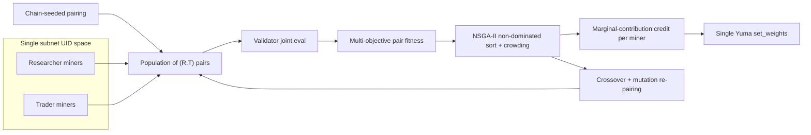

# Insignia Subnet — Paired Genetic Incentive Mechanism

**Status:** Migration spec — supersedes the two-layer (L1 → promotion → L2) design.
**Scope:** Replaces the dual Yuma-cycle architecture with a *single* incentive
mechanism in which researcher miners and trader miners are matched into pairs,
jointly evaluated, and selected/rewarded with an NSGA-II-style genetic algorithm.

---

## 1. Why migrate away from two layers

The original design (see [SUBNET_SPEC.md](SUBNET_SPEC.md)) ran two independent
consensus cycles joined by retroactive feedback:

- **Layer 1** scored ML models against a proprietary benchmark (7 metrics).
- **Layer 2** scored trading strategies that *self-selected* models from a
  promoted pool (10 metrics).
- A `cross_layer.py` feedback engine adjusted L1 scores after the fact, and
  `l1_l2_emission_split` divided emissions between the layers.

This created three structural problems:

1. **Split emissions and a promotion bottleneck.** Only top-N models reached
   Layer 2, so most model/strategy combinations were never tried. The
   `l1_l2_emission_split` itself became an attack surface (Vector 18).
2. **Indirect credit.** A great model only earned L2 credit if some trader
   happened to pick it; a great trader was capped by the pool it could choose
   from. Retroactive feedback was noisy and lagged by `min_l2_epochs`.
3. **Self-selection enabled collusion.** Because traders chose their own models,
   a researcher and trader could privately agree to only ever work together.

The firm still wants the *same two skill sets* — ML researchers and trading
operations engineers, like the desks of a pod shop — and the *same evaluation
math and weights*. What changes is how those two skill sets are combined and
rewarded.

---

## 2. Core idea: pairs as genomes, genetic selection

The subnet keeps **two miner roles on one subnet (one UID space, one
`set_weights` vector):**

- **Researcher miners** submit ML model artifacts (unchanged from the old L1
  miner task — see `neurons/researcher_miner.py`).
- **Trader miners** submit trading-operation logic that consumes a *supplied*
  model's signals (the old L2 miner task, but the model is *assigned by pairing*
  rather than self-selected — see `neurons/trader_miner.py`).

A **candidate strategy is a genome**: a `(researcher_uid, trader_uid)` pair. The
set of active pairs in an epoch is the **population** of one **generation**.



### 2.1 Joint evaluation (one validator call to each side)

For each pair `(R, T)` a validator:

1. Queries `R` for its model artifact and `T` for its trading-operation logic.
2. Runs the model on the proprietary benchmark → the **7 model metrics**
   (`CompositeScorer.score_model`).
3. Runs `T`'s strategy **using `R`'s model signals** through paper/live trading
   → the **9 trading metrics** (`CompositeScorer.score_trading`).
4. Combines the two `ScoreVector`s into a `PairScore` (see
   `CompositeScorer.combine_pair_scores`):
   - `pair_composite = alpha * model_composite + (1 - alpha) * trading_composite`
     where `alpha = pair_blend_alpha` (default `0.5`).
   - A 4-element **objective vector** for NSGA-II (all minimized):
     `[-model_composite, -trading_composite, trading_max_drawdown,
       -trading_consistency]`.

No evaluation formula or weight changes; the scoring engine in
[scoring.py](../insignia/scoring.py) is reused verbatim and the existing
`WeightConfig` (7 model weights + 9 trading weights) is preserved.

### 2.2 NSGA-II selection over pairs

Each generation, pairs are ranked by **non-dominated sorting + crowding
distance** over the objective vector (`insignia/pairing.py::NSGA2Matchmaker`,
mirroring `pymoo`'s NSGA-II used by the offline tuner). Each pair receives:

- a Pareto `rank` (0 = non-dominated front),
- a `crowding` distance (diversity along the front),
- a normalized `selection_score ∈ [0, 1]` derived from `rank` then broken by
  `crowding`.

This is genuinely multi-objective: a high-return pair with deep drawdowns does
not dominate a steadier pair, so the front retains a *diversity* of viable
desks rather than collapsing onto one metric.

### 2.3 Genetic reproduction (matchmaking across generations)

The next generation's pairs come from `ChainSeededPairing`:

- **Elite retention:** rank-0 (and the top `elite_fraction`) pairs survive.
- **Crossover:** elite researchers are re-matched with elite traders into *new*
  combinations, so a strong researcher is tried against several strong traders
  and vice-versa.
- **Mutation:** with probability `mutation_rate`, random re-pairings (including
  non-elite miners) are injected for exploration.
- **K-partner floor:** every active miner is placed in at least
  `partners_per_miner` (K) pairs per generation.

Crucially, **the assignment is deterministic from chain block state**
(`pairing_seed_source = "chain_block_hash"`). Neither miners nor validators
choose who pairs with whom, and the partner identity is unknown until evaluation
time.

### 2.4 Credit assignment → one emission vector

A miner can appear in K pairs, so we need to turn pair fitness into a single
per-miner weight. We use a **partner-averaged, variance-penalized marginal
contribution** (`insignia/pairing.py::MarginalContributionCredit`), reusing the
same `mean − λ·std` philosophy as every metric in `scoring.py`:

```
credit(m) = mean_over_partners(pair_selection_score)
            − marginal_contribution_weight · std_over_partners(pair_selection_score)
```

Credits for all miners (both roles) are clamped at 0 and normalized to sum to
1.0 → the single Yuma weight vector.

Why this rewards genuine quality:

- A researcher whose models lift **many** traders has a high mean **and** low
  variance → high credit.
- A miner that only shines with **one** partner has high variance → the penalty
  term erodes its credit, and its mean is dragged down by mediocre pairings with
  everyone else.

---

## 3. Anti-gaming design

### 3.1 Miner collusion (researcher ↔ trader, or sybil clusters)

A colluding researcher/trader agree to look good *only together*.

- **No self-selection.** Pairing is chain-seeded; a miner cannot guarantee being
  matched with its accomplice.
- **Mandatory multi-partner evaluation.** The K-partner floor forces every miner
  to be judged against partners it did not choose.
- **Variance-penalized marginal credit** (§2.4) makes non-transferable lift
  unprofitable: a pair that scores well only together produces high
  cross-partner variance and low mean elsewhere.
- **`CollusionGraphDetector`** (`insignia/pairing.py`) flags the interaction
  anomaly directly: a pair whose `pair_composite` greatly exceeds *both*
  partners' mean score with their *other* partners is flagged and its
  contribution can be discounted/zeroed.
- **Sybil clusters** (R-R or T-T) are still caught by the existing
  `ModelFingerprinter` and `CopyTradeDetector` in
  [incentive.py](../insignia/incentive.py).

### 3.2 Miner–validator collusion

- **Validators no longer choose pairings or a promotion pool**, removing the
  primary collusion lever that existed in the two-layer design.
- The existing consensus-integrity stack is retained and now applies to the
  single weight vector: `weight_entropy_minimum`,
  `cross_validator_score_variance_max`, validator rotation limits,
  `validator_agreement_threshold`, and temporal-correlation monitoring (see
  `tuning/attack_detector.py`, vectors 12–17).
- Because pair assignment is deterministic from chain state, every honest
  validator evaluating the same generation reproduces the same pairs and
  therefore the same scores — a colluding validator that deviates is detectable
  as a cross-validator variance/agreement anomaly.

### 3.3 Latency arbitrage

- **Commit-reveal is retained and extended** (`CommitRevealManager` in
  [incentive.py](../insignia/incentive.py)): both the researcher's model
  commitment and the trader's trade commitments are bound *before* the
  benchmark/market window opens.
- **Partner identity is revealed only at evaluation time** (chain-seeded), so a
  miner cannot time its submission to a known partner or validator.
- `min_prediction_lead_time` and `validator_latency_penalty_weight` continue to
  discount trades that arrive suspiciously close to data publication and scores
  from high-latency validators (vectors 10–11, plus the new
  `latency_arbitrage_pairing` vector).

---

## 4. Parameter changes

Removed (cross-layer artifacts; see [parameter_space.py](../tuning/parameter_space.py)):

- `l1_l2_emission_split`, `cross_layer_penalty_strength`, `cross_layer_latency`
- the `feedback_*` promotion-feedback group and `promotion_*` group are repurposed
  (promotion no longer exists; pairing replaces it).

Added — `pairing` group:

- `partners_per_miner` (K) — minimum partners each miner is evaluated against.
- `elite_fraction` — fraction of pairs retained as elites for reproduction.
- `mutation_rate` — probability of random re-pairing per offspring pair.
- `pair_blend_alpha` — weight on model composite vs. trading composite in
  `pair_composite`.
- `marginal_contribution_weight` — λ in the variance-penalized credit.
- `fixed_pair_correlation_threshold` — interaction-anomaly threshold for the
  collusion detector.
- `pairing_seed_source` — source of pairing randomness (`chain_block_hash`).
- `max_pairs` — population cap per generation.

The 7 model weights and 9 trading weights, the commit-reveal parameters, the
consensus-integrity parameters, the symbol-diversity (PC-VH-006) parameters, and
the economic-mechanism parameters are all preserved.

---

## 5. Bittensor mapping

The subnet now runs as a conventional single-mechanism Bittensor subnet:

- One netuid, one metagraph, one UID space shared by researcher and trader
  miners (role declared via the `role` field / commitment — see
  `insignia/protocol.py::MinerRole`).
- Each validator computes one weight vector over all miner UIDs and calls
  `subtensor.set_weights(...)` once per epoch (Yuma consensus), instead of the
  former two independent weightings. See the
  [Bittensor SDK](https://docs.learnbittensor.org/sdk/bt-api-ref) and
  [btcli](https://docs.learnbittensor.org/btcli) docs for weight-setting and
  commit-reveal primitives.
- The in-protocol genetic algorithm (pair selection per epoch) is distinct from
  the **offline** NSGA-II tuner in [optimizer.py](../tuning/optimizer.py), which
  searches *mechanism parameters* (weights, thresholds, pairing knobs) against
  the adversarial simulation. Both use NSGA-II but operate at different layers.

---

## 6. File map

- `insignia/pairing.py` — `PairGenome`, `PairFitness`, `PairingConfig`,
  `ChainSeededPairing`, `NSGA2Matchmaker`, `MarginalContributionCredit`,
  `CollusionGraphDetector`.
- `insignia/scoring.py` — adds `PairScore` + `combine_pair_scores`
  (`WeightConfig.pair_blend_alpha`); metrics/weights unchanged.
- `insignia/protocol.py` — adds `MinerRole`, `role` fields, `PairAssignment`,
  `PairEvaluationRequest`, `PairScoreReport`.
- `neurons/validator.py` — unified `PairedValidator`
  (assign → evaluate → rank → credit → single `set_weights`).
- `neurons/researcher_miner.py`, `neurons/trader_miner.py` — role-aware miner
  templates.
- `tuning/simulation.py` — pair-based generations with colluding/partner-gaming
  adversaries.
- `tuning/attack_detector.py` — adds `pair_collusion`,
  `partner_selection_gaming`, `latency_arbitrage_pairing` vectors.
- `tuning/parameter_space.py`, `tuning/optimizer.py` — pairing parameters and
  pair-harness wiring.
